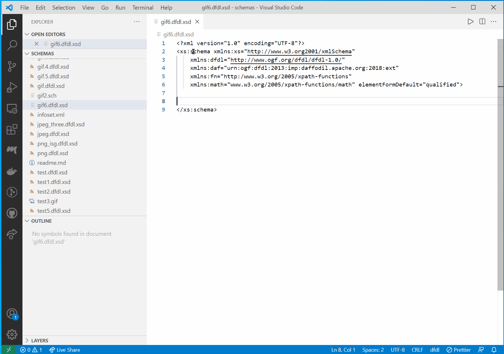
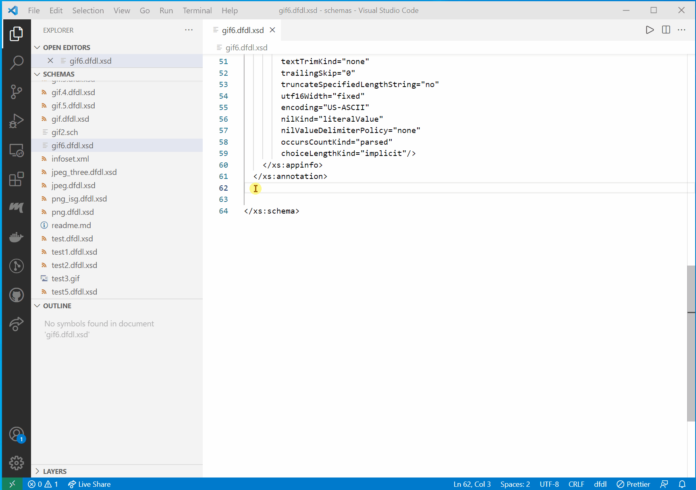
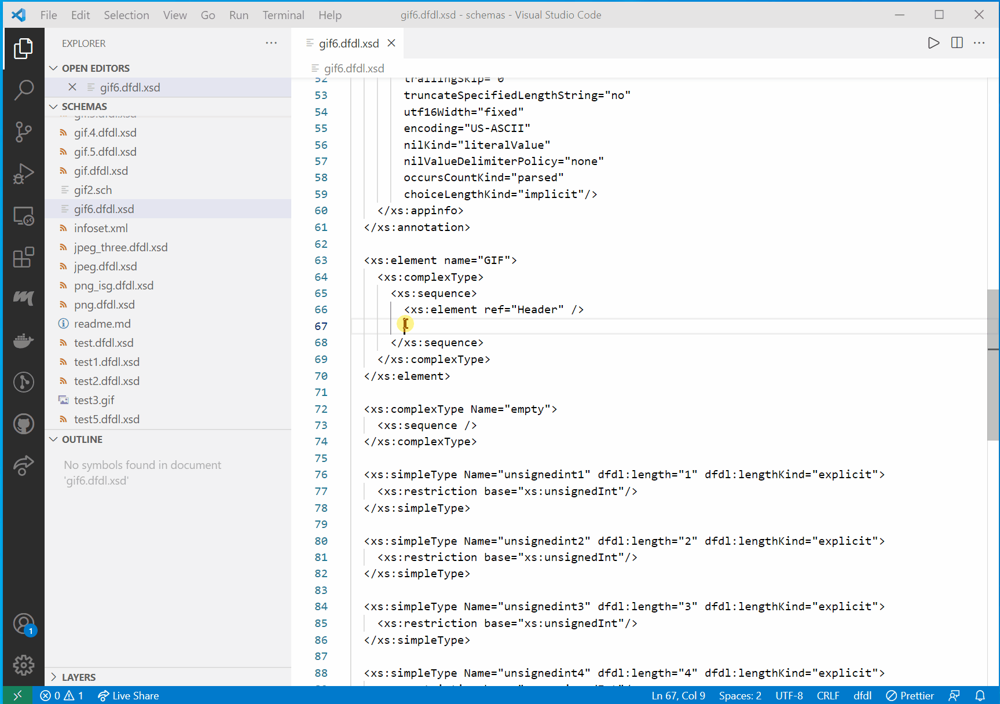
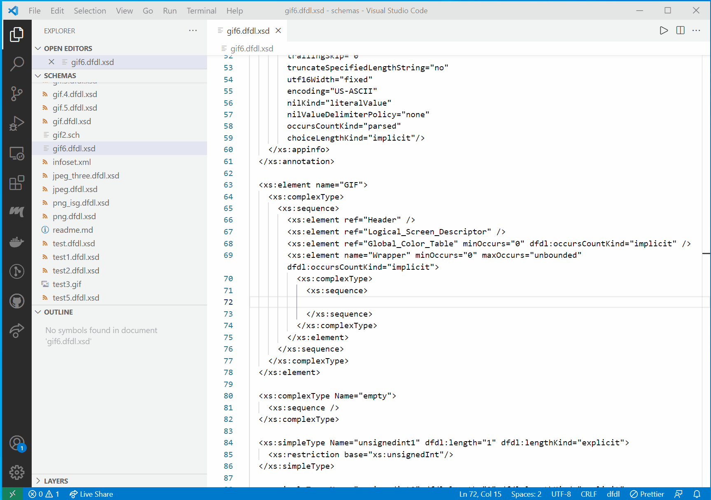
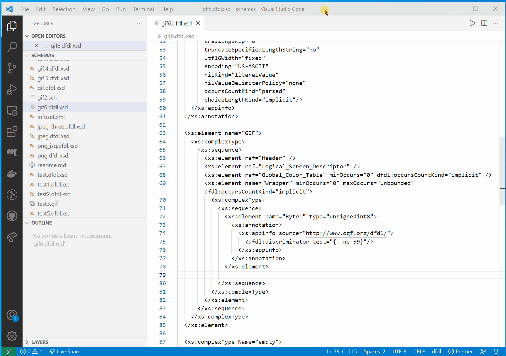

# vscode-dfdl README

The "vscode-dfdl"extension.provides auto completion for Data Format Description Language (DFDL) schemas.

## Set the editor to dfdl mode

## Features

Auto suggest is triggered using control space or typing the beginning characters of an item.

Typing one or more unique characters will further limit the results.

Add the schema block

Completing a DFDL Format Block.

The '>' or '/' characters are used to close and XML tag.
Typing the initial characters and one or more unique characters will further limit the results.

Creating self define dfdl:complextypes and dfdl:simpleTypes.

The tab key can be used to complete an auto-complete item within an XML tag.
After auto complete is triggered, typing the initial character or characters will limit the suggestion results.
Inside an XML tag a space or carriage return will trigger a list of context sensitive attribute suggestions.

Using self defined types.

Using xs:choice and dfdl:Discriminator.

## Requirements

Node.js (https://nodejs.org/en/download/)
VS Code (https://code.visualstudio.com/download)

Open a terminal window in VS Code. Run:
  npm install typescript

## Suggestions

After TypeScript is installed. Run:
npm run watch

Watch will automatically compile code when it changes
After watch runs, fix any problems in the Problems tab

Run the extension in debug mode

## Package the Extension

In a VS Code terminal window, run:
  npm install -g vsce

After the vsce install completes, run:
  vsce package

to the three warnings type 'y'.

The package vscode-dfdl-0.0.1.vsix should be in the project director.

## Install the Extension

Close VS Code if it is open. From an OS Command line, run:
  code --install-extension "path to vsix file"\vscode-dfdl-0.0.1.vsix

Re-open VS Code, open the pallet (ctrl+shift+P)
  select or type 'Change Language Mode'
  choose 'dfdl'

## Extension Settings

None

## Known Issues

The extension uses a clunky method to auto complete curly braces within quotes.  Hopefully this can be
better addressed in the future.  The auto complete method blocks auto completion suggestions while typing between the beginning qoute, opening curly brace and the closing curly brace, ending quote.

Syntax and semantic colorization isn't implemented.

## Release Notes

First beta release. Feedback is appreciated.

-----------------------------------------------------------------------------------------------------------
